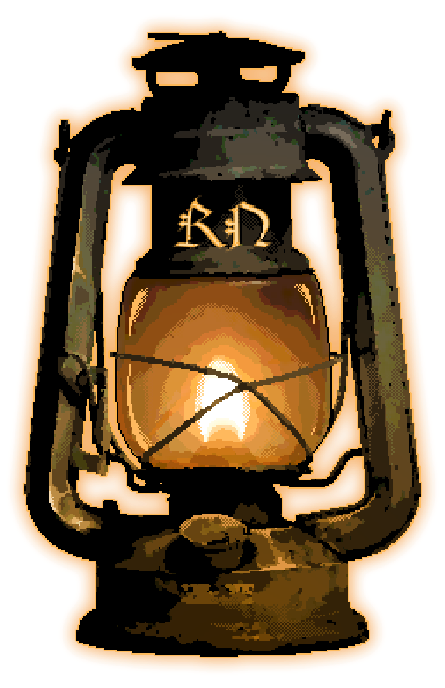
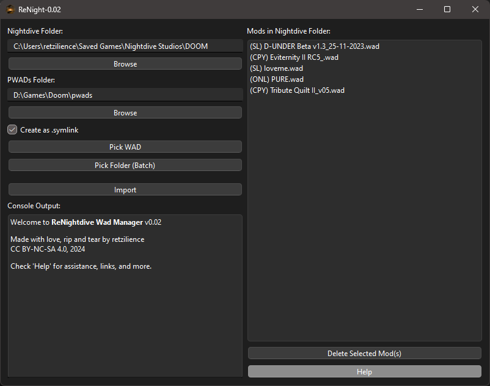
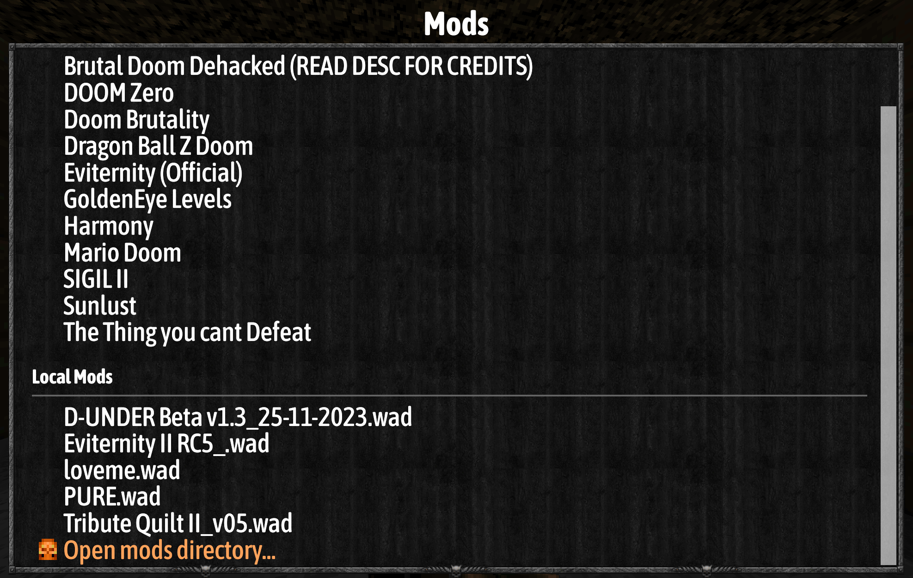
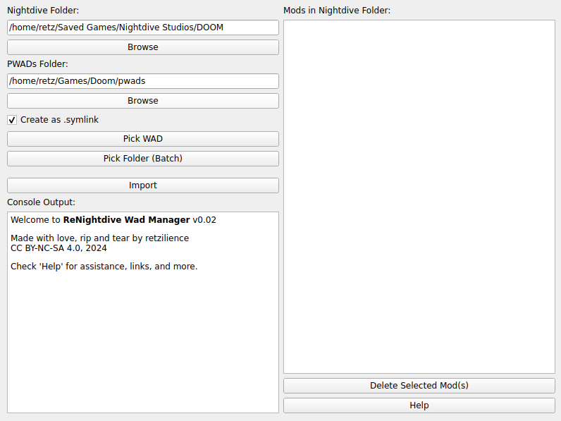

# ReNightdive Wad Manager



**ReNight** (or **ReNightdive Wad Manager**) is an open-source, Python-based GUI application designed to streamline managing DOOM WAD mods for Nightdive's 'DOOM + DOOM II' KEX 2024 source port. With an intuitive interface, it offers easy organizing and importing of WAD files, along with symbolic linking to conserve disk space.

---

## Features

- **Nightdive Folder Selection**: Set the folder where the game loads mods (default: Nightdive's DOOM mod directory).
- **PWADs Folder Selection**: Choose the folder in which you store your WADs.
- **Symbolic Link Option**: Create symbolic links for mods instead of copying, saving disk space.
- **Batch Import**: Import multiple WADs from a folder in one action.
- **Console Output**: Real-time console output for feedback and logging.
- **Mod Management**:
  - Displays mods with prefixes:
    - `(SL)` for symlinked mods
    - `(CPY)` for mods both in the Nightdive and PWADs folders
    - `(ONL)` for mods only in the Nightdive folder.
  - Delete selected mods from the Nightdive folder.
- **Persistent Configuration**: Save settings like folder paths, window size, and symbolic link preferences.

  
  

---

## Table of Contents

- [Installation](#installation)
  - [Windows](#windows)
  - [Linux](#linux)
- [Usage](#usage)
  - [Running the Application](#running-the-application)
  - [Mod Import Options](#mod-import-options)
  - [Symbolic Linking](#symbolic-linking)
- [Usage Tips](#usage-tips)
- [Changelog](#changelog)
- [License](#license)
- [Credits](#credits)

---

## Installation

### Windows

#### Option 1: Download the Latest Release (Recommended)

1. Visit the [ReNightdive Wad Manager Latest Releases](https://github.com/Retzilience/ReNight/releases/latest) page on GitHub.
2. Download the latest release zip file (e.g., **ReNight-v0.02-windows.zip**).
3. Extract the contents to a folder of your choice.
4. Run `ReNight.exe` from the extracted folder to start the application.

> **Note**: A configuration file (`config.json`) will be created in the same folder as `ReNight.exe` during your first use of the application.

#### Option 2: Run the Python Application Directly

1. Download and install [Python 3.10.6 or later](https://www.python.org/downloads/).
2. Clone the repository or download and extract the source code:
   ```shell
   git clone https://github.com/Retzilience/ReNight.git
   cd ReNight
   ```
3. Set up a virtual environment and activate it:
   ```shell
   python -m venv venv
   venv\Scripts\activate
   ```
4. Install the required dependencies:
   ```shell
   pip install -r requirements.txt
   ```
5. Run the application directly with:
   ```shell
   python ReNight.pyw
   ```

#### Option 3: Build from Source

1. Follow the setup in Option 2 to clone the repository and set up a virtual environment.
2. Activate the virtual environment:
   ```shell
   venv\Scripts\activate
   ```
3. Build the application with PyInstaller:
   ```shell
   pyinstaller --onefile --windowed --icon=ReNight.ico --add-data "ReNight.ico;." ReNight.pyw
   ```
4. Run the executable created in the `dist` folder:
   ```shell
   dist\ReNight.exe
   ```

### Linux

#### New: Linux Executable Release

I'm excited to announce that ReNight now includes a compiled Linux version! The latest build can be downloaded from the **[ReNight GitHub Releases](https://github.com/Retzilience/ReNight/releases/latest)** page.

<details></details>

#### Option 1: Download the Compiled Linux Version (Recommended)

1. Download the latest **ReNight-v0.02-linux.tar.gz** file from [GitHub Releases](https://github.com/Retzilience/ReNight/releases/latest).
2. Extract the contents:
   ```shell
   tar -xzvf ReNight-v0.02-linux.tar.gz
   ```
3. Run the executable:
   ```shell
   ./ReNight
   ```

#### Option 2: Run the Python Application Directly

1. Ensure Python 3 and `pip` are installed:
   ```shell
   sudo apt update
   sudo apt install python3 python3-pip python3-venv
   ```
2. Clone the repository:
   ```shell
   git clone https://github.com/Retzilience/ReNight.git
   cd ReNight
   ```
3. Set up and activate a virtual environment:
   ```shell
   python3 -m venv venv
   source venv/bin/activate
   ```
4. Install the required dependencies:
   ```shell
   pip install -r requirements.txt
   ```
5. Run the application directly with:
   ```shell
   python3 ReNight.pyw
   ```

---

## Usage

### Running the Application

After launching, the main window provides options to select folders, import WADs, and view current mods in the Nightdive folder.

### Mod Import Options

- **Pick WAD**: Select specific WAD file(s) to import.
- **Pick Folder (Batch)**: Choose a folder containing multiple WAD files to import them all at once.
- **Symbolic Link Option**: When checked, WADs are imported as symbolic links rather than being copied to the Nightdive Folder.

### Symbolic Linking

- Enabling this option saves disk space by creating a symbolic link to the file in the Nightdive Folder.
- Note: Symbolic links may not work on all systems or configurations, so use this option as needed.

---

## Usage Tips

1. **Set Your PWADs Folder First**: Setting this allows for accurate detection of copied mods.
2. **Switch Between Copy and Link Modes**: To change a mod from `(SL)` to `(CPY)` or vice versa, simply re-import it with the desired option.
3. **Config Persistence**: Folder settings, window size, and symbolic link preferences are saved in `config.json`, persisting between sessions.
4. **Limitations**:
   - The application can only load single-WAD mods directly through the Nightdive source port's in-game UI.
   - `.pk3` files, UDMF, and GZDoom mods are incompatible with the KEX source port.

---

## Changelog

### ReNight - DOOM Wad Manager v0.02

- **Improved Selection Behavior**: Seamless switching between "Pick WAD" and "Pick Folder (Batch)" selections.
- **Real-Time Mod List Updates**: Immediate visual feedback on folder path changes.
- **Enhanced Help Documentation**: Clearer instructions and usage tips.
- **New Application Icon**: A redesigned icon by **RataUnderground**.
- **Linux Release**: Compiled Linux executable now available!

---

## License

This project is licensed under the Creative Commons Attribution-NonCommercial-ShareAlike 4.0 International License. For more details, visit [CC BY-NC-SA 4.0](http://creativecommons.org/licenses/by-nc-sa/4.0/).

---

## Credits

Made with love, rip and tear by **retzilience**, 2024.

### Contributors

Special thanks to **RataUnderground** for the updated app icon!

---

For updates, visit the [GitHub Repository](https://github.com/Retzilience/ReNight).

---
