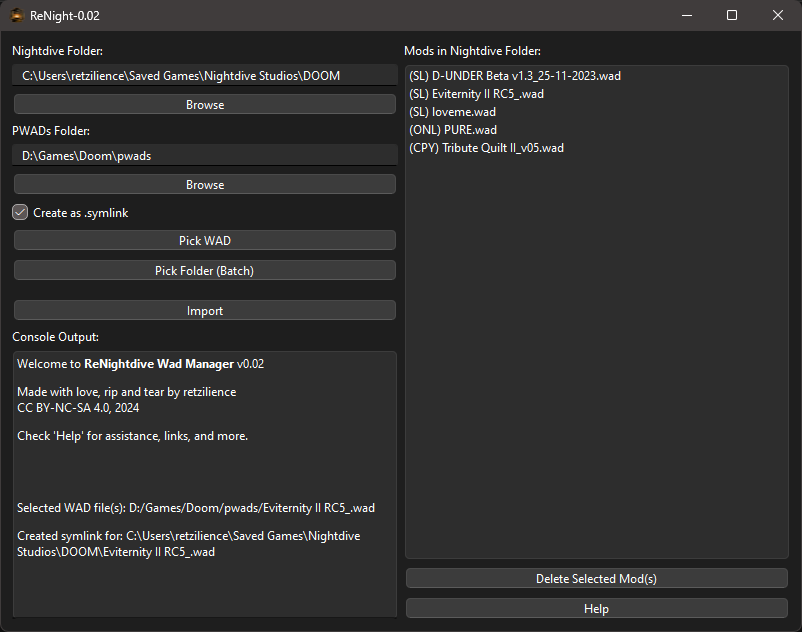

# ReNightdive Wad Manager


ReNight (or ReNightdive Wad Manager) is an opensource Python-based GUI application designed to help you manage DOOM WAD mods for Nightdive's 'DOOM + DOOM II' KEX 2024 sourceport. This tool provides a user-friendly interface for organizing and importing WAD files, with support for symbolic linking to save disk space.

---

## Features

- **Nightdive Folder Selection**: Set the folder where the game loads mods from (default: Nightdive's DOOM mod directory).
- **PWADs Folder Selection**: Choose the folder in which you store your WADs.
- **Symbolic Link Option**: Optionally create symbolic links for mods instead of copying, saving disk space.
- **Batch Import**: Import multiple WADs from a folder.
- **Console Output**: Real-time console output for user feedback and logging.
- **Mod Management**:
  - Display mods with prefixes:
    - `(SL)` for symlinked mods
    - `(CPY)` for mods both in the Nightdive and PWADs folders
    - `(ONL)` for mods only in the Nightdive folder.
  - Delete selected mods from the Nightdive folder.
- **Persistent Configuration**: Save settings like folder paths, window size, and symbolic link preference.

---

## Table of Contents
- [Installation](#installation)
  - [Windows](#windows)
  - [Linux](#linux)
- [Usage](#usage)
  - [Running the Application](#running-the-application)
  - [Mod Import Options](#mod-import-options)
  - [Symbolic Linking](#symbolic-linking)
- [Usage Tips](#usage-tips)
- [License](#license)
- [Credits](#credits)

---

## Installation

### Windows

#### Option 1: Download the Latest Release

1. Visit the [ReNightdive Wad Manager Releases](https://github.com/Retzilience/ReNight/releases) page on GitHub.
2. Download the latest release zip file: **[ReNight-v0.1.0.zip](https://github.com/Retzilience/ReNight/releases/download/v0.1.0/ReNight-v0.1.0.zip)**.
3. Extract the contents of the zip file to a folder of your choice.
4. Run `ReNight.exe` from the extracted folder to start the application.

> **Note**: The configuration file (`config.json`) will be created in the same folder as `ReNight.exe` during your first use of the application.

#### Option 2: Run the Python Application Directly

1. Download and install [Python 3.10.6 or later](https://www.python.org/downloads/).
2. Clone the repository or download and extract the source code:
   ```
   git clone https://github.com/Retzilience/ReNight.git
   cd ReNight
   ```
3. Install the required dependencies:
   ```
   pip install -r requirements.txt
   ```
4. Run the application directly with:
   ```
   python ReNight.pyw
   ```

#### Option 3: Build from Source

1. Clone the repository and set up a virtual environment as described in Option 2.
2. Activate the virtual environment:
   ```
   venv\Scripts\activate
   ```
3. Build the application with PyInstaller:
   ```
   pyinstaller --onefile --windowed --icon=ReNight.ico --add-data "ReNight.ico;." ReNight.pyw
   ```
4. Run the executable created in the `dist` folder:
   ```
   dist\ReNight.exe
   ```

### Linux

#### Option 1: Run the Python Application Directly

1. Ensure Python 3 and `pip` are installed:
   ```
   sudo apt update
   sudo apt install python3 python3-pip python3-venv
   ```
2. Clone the repository:
   ```
   git clone https://github.com/Retzilience/ReNight.git
   cd ReNight
   ```
3. Install the required dependencies:
   ```
   pip install -r requirements.txt
   ```
4. Run the application directly with:
   ```
   python3 ReNight.pyw
   ```

#### Option 2: Build from Source

1. Follow the instructions in Option 1 to set up the repository and dependencies.
2. Build the application with PyInstaller:
   ```
   pyinstaller --onefile --windowed --icon=ReNight.ico --add-data "ReNight.ico:." ReNight.pyw
   ```
3. Run the executable created in the `dist` folder:
   ```
   ./dist/ReNight
   ```

---

## Usage

### Running the Application

After launching, the main window will provide options to select folders, import WADs, and view current mods in the Nightdive folder.

### Mod Import Options

- **Pick WAD**: Allows you to select WAD file to import.
- **Pick Folder (Batch)**: Select a folder containing multiple WAD files to import them all at once.
- **Symbolic Link Option**: When checked, WADs are imported as symbolic links rather than copied to the Nightdive Folder.

 

### Symbolic Linking

- Enabling this option saves disk space by creating a symbolic link to the file in the Nightdive Folder.
- Note: Symbolic links may not work on all systems or configurations, so use this option as needed.

---

## Usage Tips

1. **Set Your PWADs Folder**: Setting this first allows for accurate detection of copied mods.
2. **Switch Between Copy and Link Modes**: To change a mod from `(SL)` to `(CPY)` or vice versa, simply re-import it with the desired option.
3. **Config Persistence**: Your folder settings, window size, and symbolic link preferences are saved in `config.json`, so they persist between sessions.
4. **Limitations**:
   - The application can only load single-WAD mods directly through the Nightdive source port's in-game UI.
   - `.pk3` files, UDMF, and GZDoom mods are incompatible with the KEX sourceport.

---

## License

This project is licensed under the Creative Commons Attribution-NonCommercial-ShareAlike 4.0 International License. For more details, visit [CC BY-NC-SA 4.0](http://creativecommons.org/licenses/by-nc-sa/4.0/).

---

## Credits

Made with love, rip and tear by **retzilience**, 2024.

---

For updates, see the [GitHub Repository](https://github.com/Retzilience/ReNight).

---
